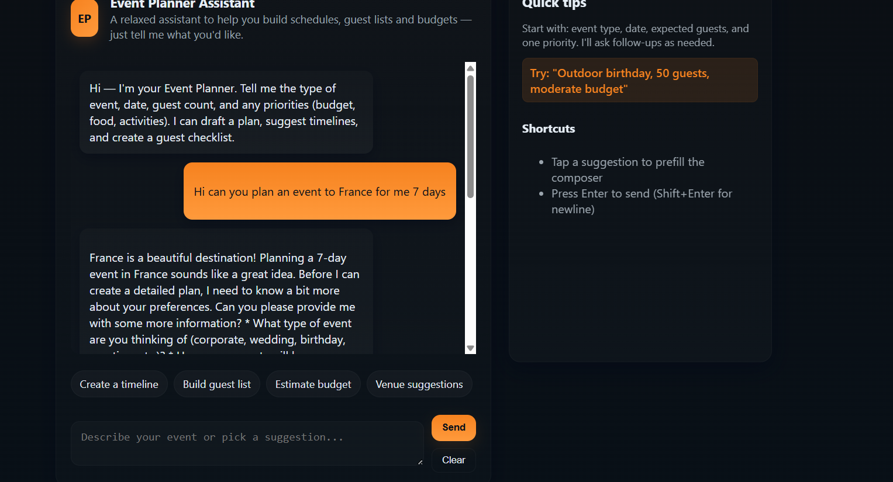
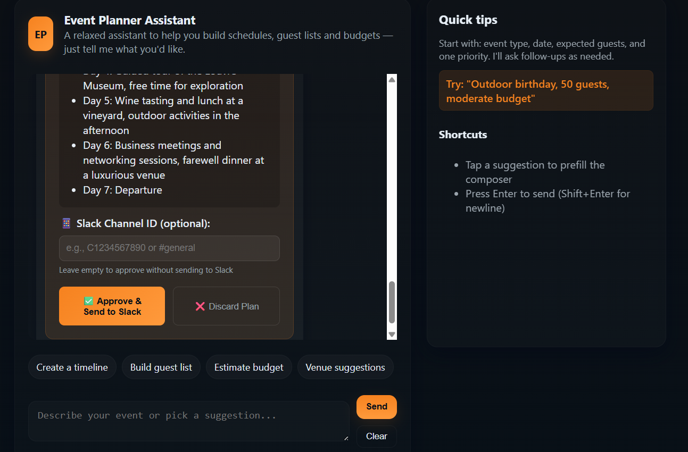
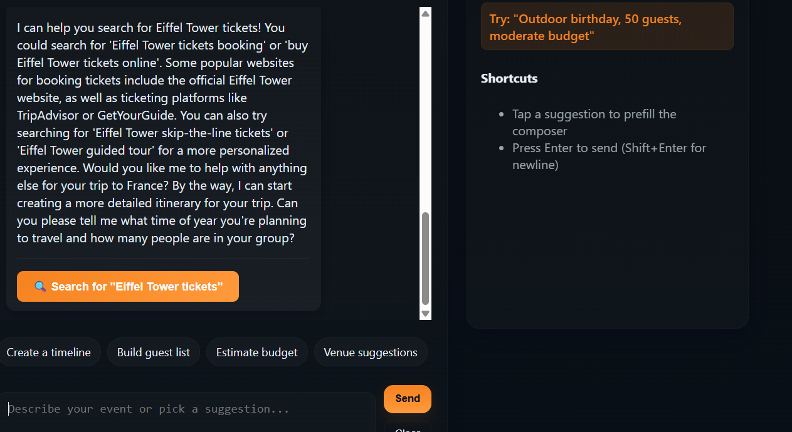
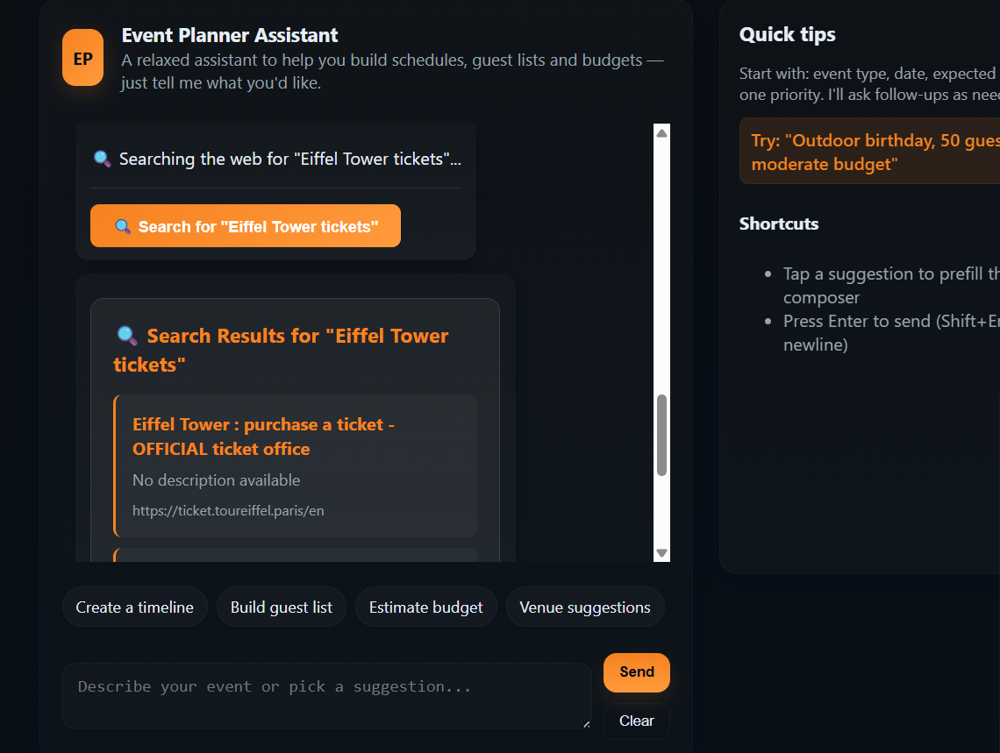
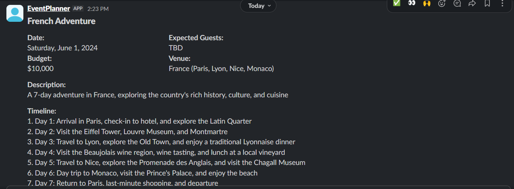

# Event Planner Assistant

An intelligent conversational event planning assistant built with Cloudflare Workers AI, featuring real-time web search capabilities and Slack integration for seamless event coordination.

Recommended:

**Live Demo**: [https://event-planner.jameslokejw.workers.dev](https://event-planner.jameslokejw.workers.dev)

## Overview

The Event Planner Assistant allows users to plan events through natural conversation. The AI assistant can search the web for venues, tickets, catering services, and other event resources, then automatically share approved event plans with team members via Slack.

## Key Features

**Conversational Event Planning**
- Natural language interface for describing event requirements
- AI-powered generation of comprehensive event plans including timelines, budgets, and guest lists
- Interactive approval system for reviewing and modifying plans before sharing

Images:






**Real-Time Web Search Integration**
- Automatic web search for event resources based on user requirements
- Smart query generation using AI to extract relevant search terms
- Support for finding venues, tickets, catering, supplies, and general event information
- Search results integrated directly into the chat interface

**Slack Integration**
- Automatic posting of approved event plans to designated Slack channels
- Rich formatting with structured event details
- Webhook support for real-time Slack communication
- Team collaboration through shared event planning

**Intelligent Resource Discovery**
- Context-aware search suggestions based on event type and requirements
- Enhanced search queries with resource-specific keywords
- Direct links to booking and information pages

## Technical Architecture

Built on Cloudflare Workers platform with:
- **Cloudflare Workers AI**: Powers the conversational interface using Llama 3.3 70B model
- **Web Search Engine**: HTTP-based search using DuckDuckGo for reliable results
- **Slack Bot Integration**: Full webhook and API integration for team communication
- **TypeScript**: Type-safe development with modular architecture
- **Real-time Streaming**: Server-Sent Events for responsive user experience

## Getting Started

### Prerequisites
- Cloudflare account with Workers AI access
- Slack workspace and bot token for integration
- Node.js v18 or newer
- Wrangler CLI

### Installation
```bash
npm install
npx wrangler deploy
```

## Usage

1. **Start a Conversation**: Describe your event requirements in natural language
2. **Review Suggestions**: The AI will generate a comprehensive event plan with timeline and budget
3. **Search for Resources**: Click search buttons to find venues, tickets, and services
4. **Approve and Share**: Review the plan and approve it to automatically share via Slack
5. **Team Collaboration**: Team members receive structured event details in Slack

## Example Workflow

```
User: "I need to plan a birthday party for 20 people next weekend"
AI: Generates detailed plan with venue suggestions, catering options, timeline
User: Clicks search buttons to find specific venues and catering services
AI: Displays real search results with booking links
User: Approves the final plan
System: Automatically posts structured event details to Slack channel
```

## Getting Started

### Prerequisites

- [Node.js](https://nodejs.org/) (v18 or newer)
- [Wrangler CLI](https://developers.cloudflare.com/workers/wrangler/install-and-update/)
- A Cloudflare account with Workers AI access

### Installation

1. Clone this repository:

   ```bash
   git clone https://github.com/cloudflare/templates.git
   cd templates/llm-chat-app
   ```

2. Install dependencies:

   ```bash
   npm install
   ```

3. Generate Worker type definitions:
   ```bash
   npm run cf-typegen
   ```

### Development

Start a local development server:

```bash
npm run dev
```

This will start a local server at http://localhost:8787.

Note: Using Workers AI accesses your Cloudflare account even during local development, which will incur usage charges.

### Deployment

Deploy to Cloudflare Workers:

```bash
npm run deploy
```

### Monitor

View real-time logs associated with any deployed Worker:

```bash
npm wrangler tail
```

## Project Structure

```
/
├── public/             # Static assets
│   ├── index.html      # Chat UI HTML
│   └── chat.js         # Chat UI frontend script
├── src/
│   ├── index.ts        # Main Worker entry point
│   └── types.ts        # TypeScript type definitions
├── test/               # Test files
├── wrangler.jsonc      # Cloudflare Worker configuration
├── tsconfig.json       # TypeScript configuration
└── README.md           # This documentation
```

## How It Works

### Backend

The backend is built with Cloudflare Workers and uses the Workers AI platform to generate responses. The main components are:

1. **API Endpoint** (`/api/chat`): Accepts POST requests with chat messages and streams responses
2. **Streaming**: Uses Server-Sent Events (SSE) for real-time streaming of AI responses
3. **Workers AI Binding**: Connects to Cloudflare's AI service via the Workers AI binding

### Frontend

The frontend is a simple HTML/CSS/JavaScript application that:

1. Presents a chat interface
2. Sends user messages to the API
3. Processes streaming responses in real-time
4. Maintains chat history on the client side

## Customization

### Changing the Model

To use a different AI model, update the `MODEL_ID` constant in `src/index.ts`. You can find available models in the [Cloudflare Workers AI documentation](https://developers.cloudflare.com/workers-ai/models/).

### Using AI Gateway

The template includes commented code for AI Gateway integration, which provides additional capabilities like rate limiting, caching, and analytics.

To enable AI Gateway:

1. [Create an AI Gateway](https://dash.cloudflare.com/?to=/:account/ai/ai-gateway) in your Cloudflare dashboard
2. Uncomment the gateway configuration in `src/index.ts`
3. Replace `YOUR_GATEWAY_ID` with your actual AI Gateway ID
4. Configure other gateway options as needed:
   - `skipCache`: Set to `true` to bypass gateway caching
   - `cacheTtl`: Set the cache time-to-live in seconds

Learn more about [AI Gateway](https://developers.cloudflare.com/ai-gateway/).

### Modifying the System Prompt

The default system prompt can be changed by updating the `SYSTEM_PROMPT` constant in `src/index.ts`.

### Styling

The UI styling is contained in the `<style>` section of `public/index.html`. You can modify the CSS variables at the top to quickly change the color scheme.

## Resources

- [Cloudflare Workers Documentation](https://developers.cloudflare.com/workers/)
- [Cloudflare Workers AI Documentation](https://developers.cloudflare.com/workers-ai/)
- [Workers AI Models](https://developers.cloudflare.com/workers-ai/models/)
